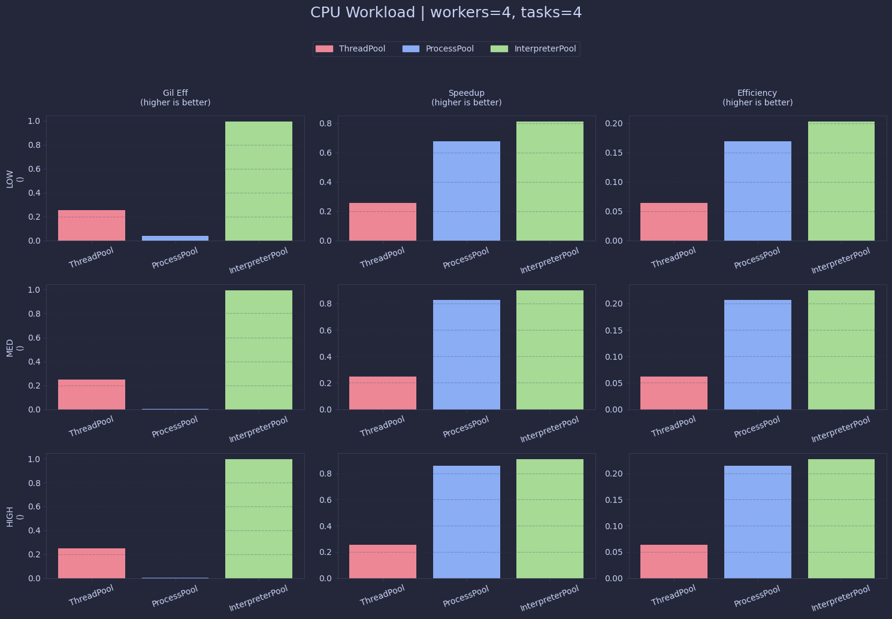
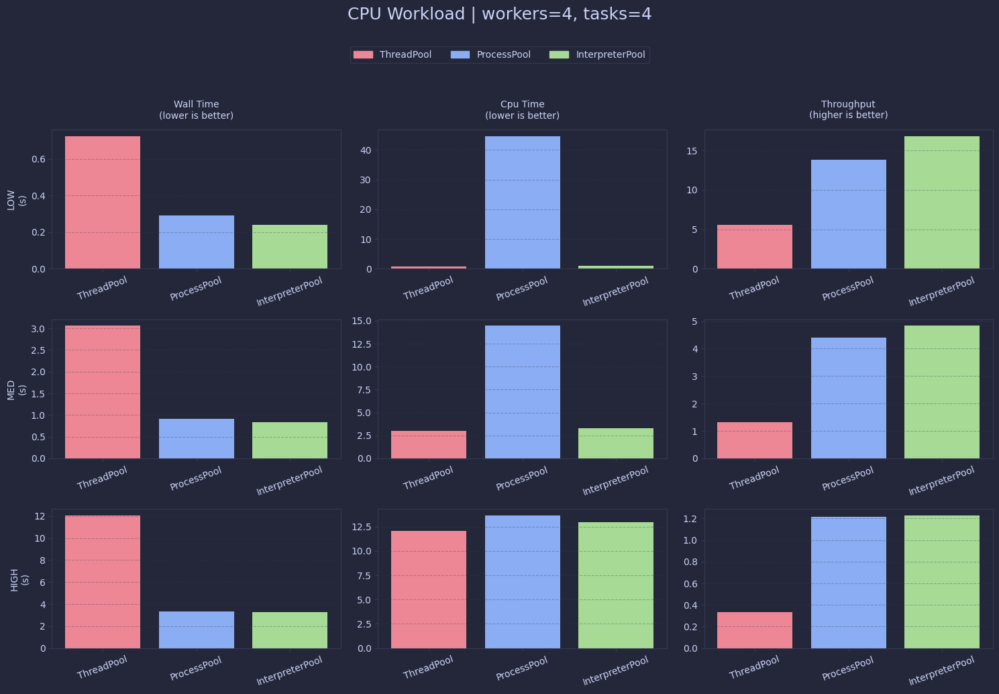
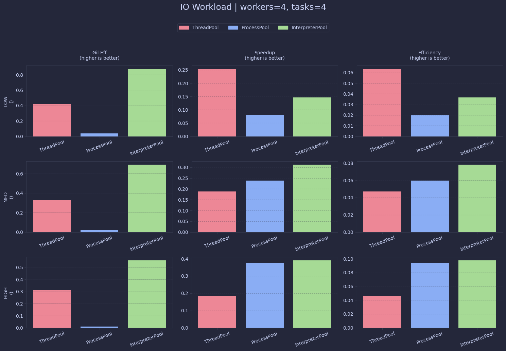
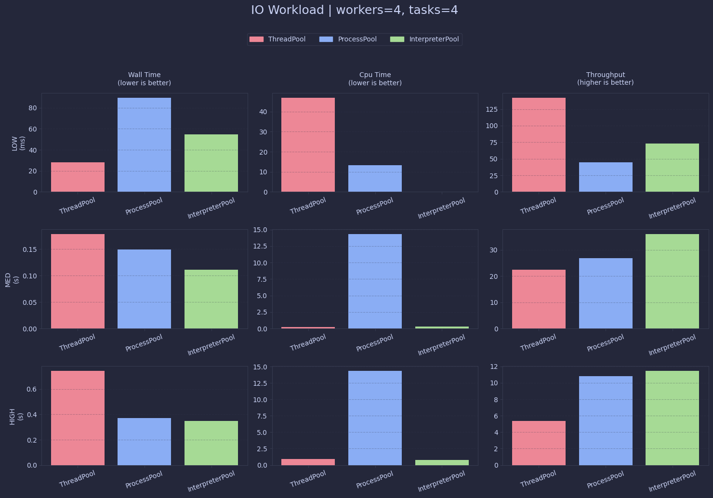
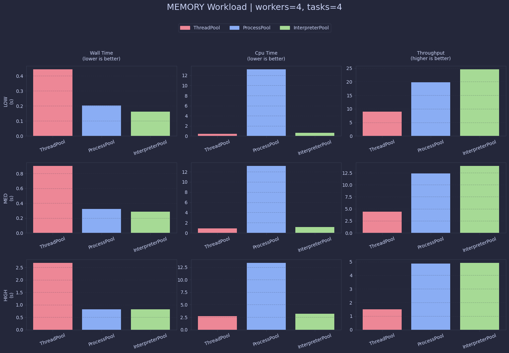
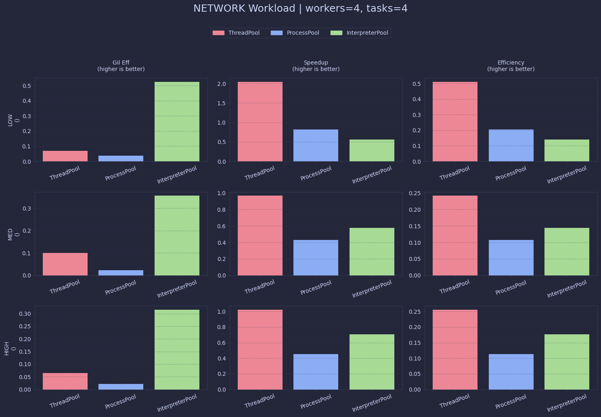
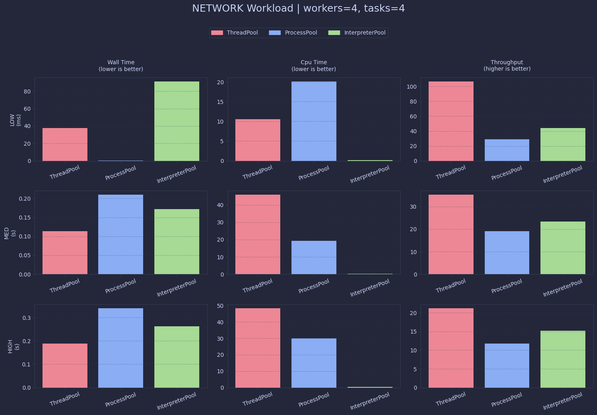

# Benchmark Report (28-03-2026-23-09)

## Machine Specs

| Property | Value |
|----------|-------|
| Operating System | Darwin 24.6.0 |
| Architecture | arm64 |
| CPU | arm |
| CPU Cores | 8 |
| Memory | 24.0 GB |
| Python Version | 3.14.3 |

---

## Plots

### cpu_efficiency.png

### cpu_performance.png

### io_efficiency.png

### io_performance.png

### memory_efficiency.png

### memory_performance.png

### network_efficiency.png

### network_performance.png

---

## Benchmark Summary

### ThreadPool

#### CPU

| Level | Wall Time (s) | CPU Time (s) | Throughput | Speedup | Efficiency | GIL Eff | Memory (MB) |
|-------|---------------|--------------|------------|---------|------------|---------|-------------|
| low | 0.7254 | 0.7293 | 5.51 | 0.26 | 0.06 | 0.25 | 26.12 |
| med | 3.0571 | 3.0258 | 1.31 | 0.25 | 0.06 | 0.25 | 26.88 |
| high | 12.0426 | 12.0621 | 0.33 | 0.26 | 0.06 | 0.25 | 26.89 |

#### MEMORY

| Level | Wall Time (s) | CPU Time (s) | Throughput | Speedup | Efficiency | GIL Eff | Memory (MB) |
|-------|---------------|--------------|------------|---------|------------|---------|-------------|
| low | 0.4448 | 0.4484 | 8.99 | 0.25 | 0.06 | 0.25 | 115.50 |
| med | 0.9017 | 0.9021 | 4.44 | 0.25 | 0.06 | 0.25 | 81.92 |
| high | 2.6834 | 2.6855 | 1.49 | 0.25 | 0.06 | 0.25 | 85.09 |

#### IO

| Level | Wall Time (s) | CPU Time (s) | Throughput | Speedup | Efficiency | GIL Eff | Memory (MB) |
|-------|---------------|--------------|------------|---------|------------|---------|-------------|
| low | 0.0281 | 0.0470 | 142.37 | 0.25 | 0.06 | 0.42 | 128.28 |
| med | 0.1781 | 0.2328 | 22.46 | 0.19 | 0.05 | 0.33 | 213.41 |
| high | 0.7442 | 0.9227 | 5.37 | 0.18 | 0.05 | 0.31 | 226.78 |

#### NETWORK

| Level | Wall Time (s) | CPU Time (s) | Throughput | Speedup | Efficiency | GIL Eff | Memory (MB) |
|-------|---------------|--------------|------------|---------|------------|---------|-------------|
| low | 0.0374 | 0.0105 | 106.85 | 2.05 | 0.51 | 0.07 | 231.47 |
| med | 0.1135 | 0.0459 | 35.25 | 0.97 | 0.24 | 0.10 | 232.09 |
| high | 0.1883 | 0.0485 | 21.25 | 1.02 | 0.25 | 0.06 | 232.52 |

### ProcessPool

#### CPU

| Level | Wall Time (s) | CPU Time (s) | Throughput | Speedup | Efficiency | GIL Eff | Memory (MB) |
|-------|---------------|--------------|------------|---------|------------|---------|-------------|
| low | 0.2892 | 0.0447 | 13.83 | 0.68 | 0.17 | 0.04 | 232.62 |
| med | 0.9110 | 0.0144 | 4.39 | 0.83 | 0.21 | 0.00 | 232.62 |
| high | 3.3001 | 0.0137 | 1.21 | 0.86 | 0.21 | 0.00 | 232.61 |

#### MEMORY

| Level | Wall Time (s) | CPU Time (s) | Throughput | Speedup | Efficiency | GIL Eff | Memory (MB) |
|-------|---------------|--------------|------------|---------|------------|---------|-------------|
| low | 0.2024 | 0.0132 | 19.76 | 0.54 | 0.14 | 0.02 | 171.95 |
| med | 0.3245 | 0.0131 | 12.33 | 0.69 | 0.17 | 0.01 | 162.12 |
| high | 0.8225 | 0.0134 | 4.86 | 0.82 | 0.20 | 0.00 | 161.88 |

#### IO

| Level | Wall Time (s) | CPU Time (s) | Throughput | Speedup | Efficiency | GIL Eff | Memory (MB) |
|-------|---------------|--------------|------------|---------|------------|---------|-------------|
| low | 0.0896 | 0.0134 | 44.64 | 0.08 | 0.02 | 0.04 | 172.88 |
| med | 0.1487 | 0.0143 | 26.90 | 0.24 | 0.06 | 0.02 | 237.00 |
| high | 0.3699 | 0.0144 | 10.81 | 0.38 | 0.09 | 0.01 | 255.70 |

#### NETWORK

| Level | Wall Time (s) | CPU Time (s) | Throughput | Speedup | Efficiency | GIL Eff | Memory (MB) |
|-------|---------------|--------------|------------|---------|------------|---------|-------------|
| low | 0.1390 | 0.0201 | 28.78 | 0.82 | 0.21 | 0.04 | 255.70 |
| med | 0.2097 | 0.0193 | 19.07 | 0.43 | 0.11 | 0.02 | 255.70 |
| high | 0.3403 | 0.0301 | 11.75 | 0.45 | 0.11 | 0.02 | 255.70 |

### InterpreterPool

#### CPU

| Level | Wall Time (s) | CPU Time (s) | Throughput | Speedup | Efficiency | GIL Eff | Memory (MB) |
|-------|---------------|--------------|------------|---------|------------|---------|-------------|
| low | 0.2376 | 0.9446 | 16.84 | 0.81 | 0.20 | 0.99 | 259.33 |
| med | 0.8277 | 3.2892 | 4.83 | 0.90 | 0.23 | 0.99 | 259.28 |
| high | 3.2603 | 12.9966 | 1.23 | 0.91 | 0.23 | 1.00 | 259.31 |

#### MEMORY

| Level | Wall Time (s) | CPU Time (s) | Throughput | Speedup | Efficiency | GIL Eff | Memory (MB) |
|-------|---------------|--------------|------------|---------|------------|---------|-------------|
| low | 0.1625 | 0.6437 | 24.62 | 0.67 | 0.17 | 0.99 | 207.12 |
| med | 0.2876 | 1.1401 | 13.91 | 0.78 | 0.19 | 0.99 | 210.52 |
| high | 0.8126 | 3.2098 | 4.92 | 0.83 | 0.21 | 0.99 | 211.62 |

#### IO

| Level | Wall Time (s) | CPU Time (s) | Throughput | Speedup | Efficiency | GIL Eff | Memory (MB) |
|-------|---------------|--------------|------------|---------|------------|---------|-------------|
| low | 0.0547 | 0.1917 | 73.11 | 0.15 | 0.04 | 0.88 | 253.38 |
| med | 0.1111 | 0.3071 | 36.01 | 0.31 | 0.08 | 0.69 | 409.95 |
| high | 0.3486 | 0.7789 | 11.48 | 0.39 | 0.10 | 0.56 | 425.14 |

#### NETWORK

| Level | Wall Time (s) | CPU Time (s) | Throughput | Speedup | Efficiency | GIL Eff | Memory (MB) |
|-------|---------------|--------------|------------|---------|------------|---------|-------------|
| low | 0.0913 | 0.1918 | 43.81 | 0.56 | 0.14 | 0.53 | 426.00 |
| med | 0.1716 | 0.2443 | 23.30 | 0.58 | 0.14 | 0.36 | 426.09 |
| high | 0.2628 | 0.3309 | 15.22 | 0.71 | 0.18 | 0.31 | 426.06 |
